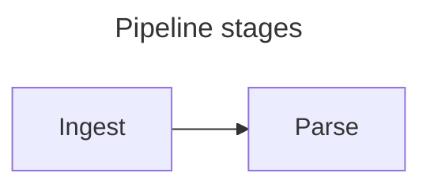

# Hermes Editor

A desktop editor for writing academic papers in markdown, with LaTeX maths,
Vega-Lite charts, and Pandoc-style citations rendered live and exported to PDF.

Hermes keeps markdown as the source of truth. There is no hidden document
format: what you type is a plain `.md` file you can put in git, and everything
on screen is rendered from it.

- **Split view** — markdown source on the left, live preview on the right,
  with optional scroll sync.
- **Maths** — LaTeX via KaTeX, inline and display.
- **Charts** — Vega-Lite specs in fenced blocks become live charts, and a
  graphical builder writes them for you: paste a table, pick a chart type,
  insert. Eleven types, including histograms, heatmaps, error bars and pie.
- **Tables** — a builder with an editable grid, per-column alignment and
  CSV/TSV import writes a padded pipe table, and reopens the one under the
  cursor for editing.
- **Diagrams** — Mermaid flowcharts, sequence diagrams, state machines and the
  rest, from a ` ```mermaid ` fence.
- **Figures** — a caption makes a figure: give a chart a title, a diagram a
  title, or an image alt text, and it is numbered automatically in document
  order, with alignment and width set document-wide.
- **Citations** — `[@key]` against a BibTeX file, formatted through CSL with
  five bundled styles and an automatic References section.
- **Zotero** — insert citations straight from your library via Better BibTeX.
- **Code** — fenced blocks are syntax highlighted in both panes from one shared
  table, so a block looks the same as you write it, after it renders, and in
  the PDF. Insert → Code Block writes the fence for you.
- **Writing tools** — formatting commands with shortcuts, block folding, an
  Insert menu, recent files, an outline panel of the document's headings
  with click-to-jump, and a New… flow that names the document and creates
  its bibliography beside it before you type a word.
- **Dark theme** — System, Light or Dark, remembered between sessions. Exported
  PDFs stay light regardless.
- **PDF export** — the preview, including charts, diagrams and references.

Latest release: **v0.9.0**. See [CHANGELOG.md](CHANGELOG.md) for what shipped
and [ROADMAP.md](ROADMAP.md) for what is planned.

---

## Download

**[Download Hermes Editor for macOS](https://github.com/richarc/hermes/releases/latest)**
— a universal build, so it runs natively on both Apple silicon and Intel.

Unzip it and drag **Hermes Editor** into your Applications folder. That is the
whole installation; there is nothing to run and nothing to configure.

The download is signed with a Developer ID and notarized by Apple, so it opens
on first launch without a security warning. If macOS ever says the app is
damaged or cannot be opened, the download was corrupted — fetch it again rather
than trying to work around the message.

Requires macOS 12 or later. Zotero with [Better
BibTeX](https://retorque.re/zotero-better-bibtex/) is optional, and only needed
for picking citations from your library.

### Updates

Hermes can check for a newer version. It fetches one small file from GitHub
(`updates/latest.json` in this repository) at most once a day and compares the
version inside it with its own; nothing about you, your machine or your
documents is sent, and nothing is downloaded or installed — if there is a
newer version you get a button that opens the release page. Hermes asks
whether to do this the first time it starts. **Help → Check for Updates
Automatically** turns it on or off later, and **Help → Check for Updates…**
checks right now.

---

## Building from source

Everything below is for working on Hermes rather than using it.

### Requirements

Hermes is currently macOS-focused. The paths, menus, and print behaviour assume
macOS; Windows and Linux support is on the backlog.

| Requirement | Notes |
|---|---|
| macOS | Apple silicon or Intel |
| [Go](https://go.dev) 1.25 or newer | Backend |
| [Node.js](https://nodejs.org) 24 or newer | Frontend build and tests |
| [Wails v3 CLI](https://v3.wails.io) | Beta (`v3.0.0-beta.12`) — match `go.mod` |
| [Zotero](https://www.zotero.org) + Better BibTeX | Optional — only for citation picking |

Install the Wails v3 CLI:

```bash
go install github.com/wailsapp/wails/v3/cmd/wails3@v3.0.0-beta.12
```

The CLI, the `github.com/wailsapp/wails/v3` module in `go.mod` and the
`@wailsio/runtime` package all need to be on the same version — `@latest`
previously resolved one release behind the Go module, so they are pinned.

### Building and running

Clone the repository, then install the frontend dependencies once:

```bash
cd frontend && npm install && cd ..
```

Then pick one:

```bash
wails3 dev       # development mode, hot-reloads Go and frontend changes
wails3 build     # production binary into bin/
wails3 package   # packaged .app bundle
```

Note that `build` does not package and `run` does not build — see
[CLAUDE.md](CLAUDE.md) for the traps that follow from that.

Wails v3 uses [Task](https://taskfile.dev) for orchestration, so `wails3 task
<name>` and `task <name>` are equivalent.

### Cutting a release

```bash
wails3 task release          # test, build universal, sign, notarize, staple, zip
wails3 task release:verify   # check a built or downloaded .app the way Gatekeeper will
```

The order matters for the update check. Bump `version` in `build/config.yml`
and `updates/latest.json` together in one commit (`release` refuses to run if
they differ), cut the release, tag it `v<version>` (the app derives the
release page from that exact tag name), publish it on GitHub with the zip
attached, and only then push `main` and the tag. Installed copies read the
feed from `main`, so pushing first would announce a version nobody can
download yet.

`release` needs a **Developer ID Application** certificate in the keychain
(not "Apple Development", and not "3rd Party Mac Developer Application" — those
are for your own devices and for the Mac App Store respectively), and
notarization credentials stored once:

```bash
xcrun notarytool store-credentials "hermes-notary" \
  --apple-id <apple-id> --team-id <team-id> --password <app-specific-password>
```

Run `wails3 task --list` to read why the steps are in the order they are; the
ordering is load-bearing and the task documents itself.

---

## Your first document

1. Launch Hermes. The startup pane lists recent files and offers **New
   document**. To open a file that is not listed, use **File → Open…** (⌘O).
2. Type markdown on the left. The preview updates as you type. Misspelled
   words are underlined as you type them, using macOS's own checker, and a
   right-click offers corrections; code, maths, citation keys, link
   addresses and the frontmatter are left alone. **View → Check Spelling**
   turns it off.
3. Save with ⌘S. Saving matters more than usual here — a bibliography is
   resolved relative to the document, so an unsaved document cannot load one.

   Hermes keeps a recovery draft while you have unsaved changes, written
   two seconds after you stop typing, so a crash loses at most that. The
   draft lives beside Hermes' settings, not over your file; the next time
   you open the document you are asked whether to restore it. **View →
   Autosave** turns this off.

### Maths

Inline maths goes between single dollars, display maths between double:

```markdown
The relation $E = mc^2$ sits inside a sentence.

$$\int_{-\infty}^{\infty} e^{-x^2}\,dx = \sqrt{\pi}$$
```

### Charts

You do not have to write a chart by hand: **Insert → Chart…** opens a builder.
Paste a table or import a CSV, choose a chart type — line, bar, point, area,
boxplot, tick, rule, histogram, heatmap, error bars or pie — and pick which
column goes where. Put the cursor back inside a chart block and the same menu
reopens it for editing.

Written by hand, a fenced block tagged `vega-lite` containing a
[Vega-Lite](https://vega.github.io/vega-lite/) spec renders as a live chart:

````markdown
```vega-lite
{
  "data": {"values": [{"a": "A", "b": 28}, {"a": "B", "b": 55}]},
  "mark": "bar",
  "encoding": {
    "x": {"field": "a", "type": "nominal"},
    "y": {"field": "b", "type": "quantitative"}
  }
}
```
````

### Diagrams

A fence tagged `mermaid` renders as a [Mermaid](https://mermaid.js.org)
diagram. Give it a `title:` in its own frontmatter and it becomes a numbered
figure, sharing one sequence with charts and images:

````markdown

````

### Figures and images

An image path is resolved relative to the document, so a figure stored beside
the file is just its filename. Non-empty alt text becomes a numbered caption;
empty alt text keeps the image decorative and unnumbered.

```markdown

```

For the full set of conventions — including the ones that silently do nothing,
like raw HTML or a `title:` in the document's frontmatter — see
[docs/hermes-authoring.md](docs/hermes-authoring.md). It is written to be
pasted into an AI assistant as instructions.

---

## Citations and bibliography

### 1. Point the document at a `.bib` file

Add a YAML frontmatter block at the very top of the document:

```markdown
---
bibliography: refs.bib
csl: apa
---

# My Paper
```

- `bibliography` is resolved **relative to the document**, so `refs.bib` means
  "next to this file". An absolute path also works.
- `csl` selects the citation style. Omit it for APA.

Bundled styles: `apa` (default), `chicago-author-date`, `ieee`, `vancouver`,
`harvard`.

Do **not** write your own `## References` heading. Hermes appends the heading
and the formatted bibliography itself, so writing one produces two.

### 2. Cite

Hermes supports the practical Pandoc subset:

| You write | You get (APA) |
|---|---|
| `[@smith2020]` | (Smith, 2020) |
| `[@smith2020; @doe2021]` | (Smith, 2020; Doe, 2021) |
| `@smith2020` | Smith (2020) |
| `[-@smith2020]` | (2020) |
| `[see @smith2020, pp. 33-35]` | (see Smith, 2020, pp. 33–35) |
| `[@nosuchkey]` | `[@nosuchkey?]` in red |

Locators are recognised as `p.` / `pp.` / `page` / `pages`, `chap.` /
`chapter`, `sec.` / `section`, or a bare number. Anything else after the comma
is kept as plain text.

A citation group may wrap across a line break — useful when your prose is
hard-wrapped:

```markdown
The effect was first reported in the original study [see @smith2020,
pp. 20-22].
```

An unresolvable key renders visibly in place rather than blanking the preview,
so a typo never costs you the rest of the document.

### 3. Editing the `.bib`

Hermes watches the bibliography file. Edit and save it in any other editor and
the preview refreshes within about two seconds — no need to reopen the
document.

---

## Setting up Zotero

Optional. Citations work fine against a hand-written `.bib`; Zotero adds a
picker so you can insert keys from your library without typing them.

The full setup — Better BibTeX, an export that stays current, and what to do
when a key inserts but will not resolve — is in
**[docs/zotero-setup.md](docs/zotero-setup.md)**.

## Exporting to PDF

**File → Export PDF…** (⌘E) prints the rendered preview, including maths,
charts, and the References section. Page orientation is set under **File → PDF
Orientation** and is remembered between sessions.

---

## Keyboard shortcuts

| Shortcut | Action |
|---|---|
| ⌘N | New… (name the document, create its bibliography) |
| ⌘O | Open… |
| ⌘S | Save |
| ⌘⇧S | Save As… |
| ⌘⇧C | Insert Citation… (Zotero picker) |
| ⌘E | Export PDF… |
| ⌘⌥O | Show or hide the outline panel |
| ⌘B / ⌘I | Bold / italic |
| ⌘⇧K / ⌘⇧X | Inline code / strikethrough |
| ⌘1 … ⌘6 | Heading level; ⌘0 back to paragraph |
| ⌘⇧8 / ⌘⇧7 | Bulleted / numbered list |
| ⌘⌥[ / ⌘⌥] | Fold / unfold the block at the cursor |

Blockquote, Insert → Chart…, Insert → Code Block and the fold-all commands
have menu items but no shortcut: an invented chord cannot be checked against
every macOS binding.

---

## Troubleshooting

**Citations show as plain `[@key]` text with no References section.** No
bibliography is loaded at all. Either the document has no `bibliography:` key
in its frontmatter, or it has never been saved.

**A citation shows red as `[@key?]`.** The bibliography loaded fine, but that
key is not in it. This is the healthy failure — the rest of the document still
renders.

**The frontmatter shows up as a heading in the preview.** The block is not
being recognised. It must start on the very first line, and both fences must be
exactly `---` on a line of their own.

**Charts do not render.** The fence must be tagged exactly `vega-lite` and the
block must contain valid JSON.

**A diagram shows an error card.** The fence must be tagged exactly `mermaid`
and the diagram must parse. The card names what Mermaid objected to.

**A local image shows a broken icon.** Its path is resolved relative to the
document, so the document must have been saved — an unsaved one has no folder
to resolve against.

**Insert → Chart… refuses to reopen a chart.** It says which property stopped
it. The builder only reopens charts it could have written itself; anything
else would have to be discarded silently to make it editable.

---

## Project layout

```
main.go               Wails app setup, services, window, events, asset routes
menu.go               Application menu and accelerators
documentservice.go    File I/O, recents, dirty tracking, bibliography, PDF
settings.go           Persisted preferences, behind Settings/UpdateSettings
localimages.go        Serves images stored beside the document
print_darwin.go       PDF export: panel first, then the print operation
zotero.go             Better BibTeX picker (CAYW) client
frontend/src/
  App.svelte          Orchestrates panes, toolbar, status bar, menu events
  Editor.svelte       CodeMirror instance and its theme
  Preview.svelte      Rendered output; chart, diagram and code hydration
  ChartBuilder.svelte The graphical chart editor
  Dialog.svelte       The shared modal shell, on native <dialog>
  lib/renderer.ts     markdown-it + KaTeX + fence dispatch + citations
  lib/figures.ts      What counts as a figure, and figure numbering
  lib/citations.ts    Citation parsing and CSL formatting
  lib/bibliography.ts BibTeX to CSL-JSON
  lib/charts.ts       Vega-Lite hydration
  lib/chartSpec.ts    BuilderState <-> Vega-Lite JSON, the round trip
  lib/dataTable.ts    Delimited-text parsing and type inference
  lib/mermaid.ts      Mermaid hydration
  lib/mermaidSource.ts  A diagram's frontmatter title
  lib/codeHighlight.ts  Syntax highlighting in the preview
  lib/syntaxTags.ts   The token table both panes share
  lib/markdownCommands.ts  Formatting commands as CodeMirror StateCommands
  lib/foldCommands.ts Fold-all-code-blocks
  lib/scrollSync.ts   Editor/preview anchoring
docs/
  test-document.md    Manual verification document — markdown, then how it renders
  hermes-authoring.md How to write a document Hermes reads, for humans or AI
  zotero-setup.md     Better BibTeX setup, and the picker's failure modes
  zotero-export-text.bib  Bibliography for it, auto-synced from Zotero
  sample-data.csv     Table for exercising the chart builder's importer
  sample-figure.png   Local image fixture
  superpowers/        Design specs and implementation plans
```

Recent files are stored in your XDG data directory as `hermes/recents.json`.

## Development

```bash
cd frontend && npm test        # Vitest suite
cd frontend && npm run check   # svelte-check, must stay at 0 errors
go test ./. && go build -o /dev/null .   # note ./. not ./...
wails3 task common:generate:bindings     # after changing a service API
```

`docs/test-document.md` is the manual counterpart to the test suites, written
to be read as an exported PDF: every section shows the markdown in a code
block and then the same text rendered, so the page itself is the evidence.
Open it in Hermes after any substantial change and press ⌘E. Section 9 is the
quickest way to see citations working — every supported form, plus the
deliberate error cases — and section 11 is meant to look broken.

## Known limitations

- macOS only for now.
- PDF export goes through the system print panel rather than rendering
  headlessly. The panel no longer shows a live preview: the preview is drawn by
  the print operation, and Hermes has to settle the print settings *before*
  creating that operation, or a long document loses its last page. Use the
  panel's PDF menu → Open in Preview instead.
- The chart builder can only reopen charts it could have written. One that sets
  something it does not model — `"axis": {"labelAngle": 0}`, a layer, a
  transform, a mark object other than an error bar — still renders, but says
  which property stopped it rather than editing it and silently dropping that
  property.
- A chart's column types are quantitative, temporal or nominal; `ordinal` is
  not offered, so a hand-written chart using it will not reopen in the builder.
- Windows and Linux are on the backlog, as is a file-tree sidebar for
  multi-part documents.
- Spell checking is as-you-type only. macOS checks the word you just typed
  and the word you leave, never a document you open, so an existing paper
  shows no underlines until you edit or move through it. A whole-document
  pass is on the roadmap. Turning **View → Check Spelling** off stops new
  underlines but does not remove the ones already on screen; those stay
  until you edit their line or reopen the document.

## Licence and credits

Hermes is licensed under the [Apache License, Version 2.0](LICENSE).
Copyright 2026 Craig Richards.

Two bundled components carry obligations of their own, both recorded in
[NOTICE](NOTICE):

- Citation formatting uses [citeproc-js](https://github.com/Juris-M/citeproc-js),
  copyright Frank Bennett, which is dual-licensed under **either** the Common
  Public Attribution License v1+ **or** the GNU Affero General Public License
  v3+, at the licensee's option. **Hermes elects the CPAL option**, which is
  file-scoped copyleft and so does not extend to the rest of this codebase.
  Its licence text is at `licenses/citeproc-js.LICENSE`.
- The bundled CSL styles and locale come from the
  [Citation Style Language](https://github.com/citation-style-language) project
  under CC-BY-SA-3.0; see `frontend/src/assets/csl/LICENSE.md`.

Every other dependency is permissively licensed (MIT, BSD-3-Clause or ISC).

Built with [Wails v3](https://v3.wails.io), [Svelte 5](https://svelte.dev),
[CodeMirror 6](https://codemirror.net), [markdown-it](https://github.com/markdown-it/markdown-it),
[KaTeX](https://katex.org), [Vega-Lite](https://vega.github.io/vega-lite/), and
[Mermaid](https://mermaid.js.org).
