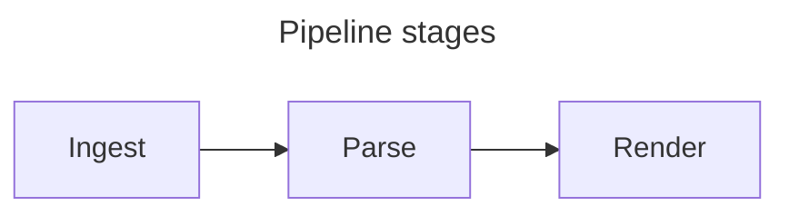
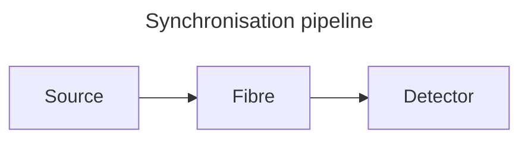

# Writing documents for Hermes

Hermes reads ordinary Markdown. It has no format of its own — citations follow
Pandoc, maths follows KaTeX, charts are Vega-Lite and diagrams are Mermaid, so
a document written for Hermes stays readable in other tools.

What follows is the part that is *not* guessable: which conventions Hermes
acts on, and the handful of things that silently do nothing.

This file is written to be pasted whole into an AI assistant as instructions
for producing a Hermes document.

---

## Frontmatter: exactly two keys

```markdown
---
bibliography: references.bib
csl: apa
---
```

`bibliography` and `csl` are the **only** keys Hermes reads. Both are optional.
The path is resolved relative to the document, so the `.bib` normally sits
beside it.

`csl` must be one of five bundled styles — `apa`, `chicago-author-date`,
`ieee`, `vancouver`, `harvard`. Anything else falls back to APA with a warning.

**The whole frontmatter block is removed before rendering.** A `title:` or
`author:` there will not appear anywhere. Put the title in the document:

```markdown
# Entanglement-verified time distribution

Craig Richards
```

## Citations

Cite by the BibTeX key. Bracketed citations are parenthetical:

```markdown
Photon pairs decohere over distance [@alqedra2026].
Two sources agree [@alqedra2026; @bennett2019].
As shown elsewhere [see @alqedra2026, p. 31].
Only the year is needed [-@alqedra2026].
```

- Separate multiple keys with `;`
- Text before the `@` becomes a prefix (`see`, `cf.`)
- A trailing `, p. 31`, `, pp. 31-34`, `, chapter 3` or `, sec. 2` is parsed as
  a locator; other trailing text becomes a suffix
- A `-` immediately before the `@` suppresses the author

A bare `@key` outside brackets is a narrative citation, for naming the author
in your own sentence:

```markdown
@alqedra2026 measured a fidelity of 0.817.
```

The bibliography is generated automatically at the end of the document under a
"References" heading. Do not write one by hand.

## Maths

KaTeX, inline with `$…$` and displayed with `$$…$$`:

```markdown
The fidelity $F = \langle\Phi^+|\rho|\Phi^+\rangle$ exceeded the classical bound.

$$
C(\rho) = \max(0, \lambda_1 - \lambda_2 - \lambda_3 - \lambda_4)
$$
```

A malformed expression renders in red rather than breaking the document. `$5`
and other prices are left alone.

## Figures: a caption is what makes a figure

A block with a caption becomes a numbered `<figure>`. A block without one
renders plainly. Charts, images and diagrams share **one** numbering sequence,
in document order.

Captions are never written as a separate paragraph. Each format carries its
own, which is what keeps them through a Pandoc conversion:

| Block | Where the caption comes from |
|---|---|
| Image | the alt text — `` |
| Vega-Lite chart | the spec's `title` |
| Mermaid diagram | a `title:` in the diagram's own frontmatter |

An image with empty alt text (``) stays decorative and is not
numbered — use that for rules and spacers.

Image paths resolve **relative to the document**, the same way `bibliography:`
does, so a figure stored beside the file is just its filename. `../shared/`
and absolute paths work too. A remote URL works as well.

```markdown


```

A document that has never been saved has no folder to resolve against, so save
it before referring to a local image.

Do not also write "Figure 1 — …" in prose; Hermes numbers and renders the
caption itself, and the number would be wrong as soon as a figure is inserted
above it.

Only top-level blocks are numbered. A chart or diagram inside a list item or a
blockquote still renders, but takes no figure number.

## Tables

GFM pipe tables render as tables. Insert → Table… opens a grid: type into the
cells, add or remove rows and columns, set a column's alignment, or paste
comma- or tab-separated text under Import. Insert writes a padded table at
the cursor; with the cursor inside an existing table the same command opens
it for editing and Update replaces it. Cells hold ordinary markdown, so
`**bold**`, links and `[@citations]` work inside them.

| Sample   | n   | Mean |
| :------- | --: | ---: |
| Control  |  12 |  4.1 |
| Treated  |  11 |  6.3 |

## Charts

A `vega-lite` fenced block holding a Vega-Lite JSON spec. Inline the data so
the document stays self-contained:

````markdown
```vega-lite
{
  "title": "Recovered sources by condition",
  "data": {"values": [
    {"dose": 0, "response": 1.5},
    {"dose": 5, "response": 3.25}
  ]},
  "mark": "line",
  "encoding": {
    "x": {"field": "dose", "type": "quantitative"},
    "y": {"field": "response", "type": "quantitative"}
  }
}
```
````

The `title` becomes the figure caption and is not drawn inside the chart.

Width and figure alignment are application settings, not document ones — do
not set `width` unless a particular chart genuinely needs to override the
document default.

A chart stays editable in the graphical builder only if it uses a single
`mark` with `x`, `y` and optional `color` encodings. `layer`, `transform` and
`facet` render fine but cannot be reopened there.

## Diagrams

A `mermaid` fenced block. Any diagram type Mermaid supports works — flowchart,
sequence, state, class, ER, gantt, pie.

````markdown

````

The `title:` in the diagram's frontmatter becomes the figure caption. Omit it
for an unnumbered diagram.

## Code

Fenced blocks are syntax highlighted in both panes. The language tag must be
one the highlighter recognises, or the block renders plain — `python`, `r`,
`julia`, `fortran`, `c++`, `javascript`, `go`, `rust`, `shell`, `sql`, `json`,
`yaml` and `latex` are all safe.

````markdown
```python
def concurrence(rho):
    return max(0, eigenvalues(rho)[0] - sum(eigenvalues(rho)[1:]))
```
````

## What does not work

- **Raw HTML.** It is escaped and appears as literal text. No `<br>`, no
  `<div align="center">`, no `<sub>`. Use Markdown, or maths for subscripts.
- **A hand-written References section.** It is generated.
- **`title:` or `author:` in frontmatter.** Silently dropped.
- **Figure numbers written by hand.** They are generated.

## A complete example

````markdown
---
bibliography: references.bib
csl: apa
---

# Entanglement-verified time distribution

## Introduction

Distributing entangled photon pairs across a metropolitan fibre network
synchronises distant clocks to tens of picoseconds [@alqedra2026].
@bennett2019 first proposed the approach.

The concurrence is bounded below by

$$
C(\rho) = \max(0, \lambda_1 - \lambda_2 - \lambda_3 - \lambda_4)
$$

## Method



## Results

```vega-lite
{
  "title": "Fidelity against fibre length",
  "data": {"values": [
    {"km": 0, "fidelity": 0.94},
    {"km": 10, "fidelity": 0.86},
    {"km": 20, "fidelity": 0.82}
  ]},
  "mark": "line",
  "encoding": {
    "x": {"field": "km", "type": "quantitative"},
    "y": {"field": "fidelity", "type": "quantitative"}
  }
}
```

Fidelity fell with distance, remaining above the classical bound throughout.
````

That document produces two numbered figures — "Figure 1 — Synchronisation
pipeline" and "Figure 2 — Fidelity against fibre length" — two resolved
citations, a display equation, and a generated reference list.
