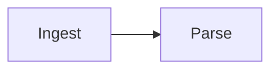

# Mermaid Diagrams Implementation Plan

> **For agentic workers:** REQUIRED SUB-SKILL: Use superpowers:subagent-driven-development (recommended) or superpowers:executing-plans to implement this plan task-by-task. Steps use checkbox (`- [ ]`) syntax for tracking.

**Goal:** Render a ` ```mermaid ` fence as a diagram in the preview and in exported PDFs, with the captions, numbering, alignment and scroll-sync anchoring a chart already gets.

**Architecture:** The chart pipeline, followed stage for stage. `figures.ts` reads the fence's frontmatter `title:` as a caption and stamps a figure number on the token; `renderer.ts` emits a placeholder carrying the diagram source with that title removed; a hydrator in `mermaid.ts` swaps each placeholder for real SVG using a dynamically imported Mermaid; `style.css` puts the result on the same white card a chart gets in dark mode.

**Tech Stack:** Svelte 5, TypeScript, markdown-it, Mermaid 11.x, Vitest + jsdom.

## Global Constraints

- The design this implements is `docs/superpowers/specs/2026-08-11-mermaid-diagrams-design.md`. Where this plan and that document disagree, the design wins.
- **`mermaid` must never be imported statically.** Only `await import('mermaid')` at the point of use, the same constraint `charts.ts` documents for `vega-embed`. A static import lands the whole library in the startup bundle.
- **`suppressErrorRendering: true` is load-bearing.** Without it, a parse failure makes Mermaid render its own error diagram into the page instead of throwing, and the error card cannot exist. Do not remove it as noise.
- No literal colours in any `style.css` rule — `styleContract.test.ts` fails the build on one, and requires the light, dark and print blocks to declare identical custom-property names.
- Scope is rendering only. No `Insert → Diagram` menu route, no diagram builder.
- Frontend tests: `cd frontend && npx vitest run <file>`. Full check before finishing a task: `cd frontend && npm test && npm run check`.

---

## File Structure

| File | Responsibility |
|---|---|
| `frontend/src/lib/mermaidSource.ts` | **New.** Split a fence's optional YAML frontmatter into its title and the diagram body |
| `frontend/src/lib/mermaidSource.test.ts` | **New.** |
| `frontend/src/lib/mermaid.ts` | **New.** The hydrator, the render function, the error card |
| `frontend/src/lib/mermaid.test.ts` | **New.** |
| `frontend/src/lib/renderer.ts` | Modify: the fence rule becomes a dispatch; a `mermaid` branch |
| `frontend/src/lib/figures.ts` | Modify: `mermaidCaption`, and a `mermaid` branch in `numberFigures` |
| `frontend/src/Preview.svelte` | Modify: a third hydrator, invalidating anchors on completion |
| `frontend/public/style.css` | Modify: `.mermaid-diagram` and `.mermaid-error` join existing rules |
| `frontend/package.json` | Modify: `mermaid` dependency |
| `CHANGELOG.md`, `ROADMAP.md` | Modify: record the feature; correct the roadmap's wrong claim |

---

### Task 1: Read the fence's frontmatter

**Files:**
- Create: `frontend/src/lib/mermaidSource.ts`
- Test: `frontend/src/lib/mermaidSource.test.ts`

**Interfaces:**
- Consumes: nothing.
- Produces: `parseMermaidSource(text: string): { title: string; body: string }`. Task 3 uses `.body`; Task 4 uses `.title`.

- [ ] **Step 1: Write the failing tests**

Create `frontend/src/lib/mermaidSource.test.ts`:

```ts
import { describe, it, expect } from 'vitest'
import { parseMermaidSource } from './mermaidSource'

describe('parseMermaidSource', () => {
  it('reports no title and returns the source untouched when there is no frontmatter', () => {
    const text = 'flowchart LR\n  A --> B\n'
    expect(parseMermaidSource(text)).toEqual({ title: '', body: text })
  })

  it('reads a plain title and removes the whole block when that was all it held', () => {
    const text = '---\ntitle: Pipeline stages\n---\nflowchart LR\n  A --> B\n'
    expect(parseMermaidSource(text)).toEqual({
      title: 'Pipeline stages',
      body: 'flowchart LR\n  A --> B\n',
    })
  })

  it('unquotes a double-quoted title', () => {
    const text = '---\ntitle: "Pipeline stages"\n---\nflowchart LR\n'
    expect(parseMermaidSource(text).title).toBe('Pipeline stages')
  })

  it('unquotes a single-quoted title', () => {
    const text = "---\ntitle: 'Pipeline stages'\n---\nflowchart LR\n"
    expect(parseMermaidSource(text).title).toBe('Pipeline stages')
  })

  // The trap this exists to avoid: taking the whole frontmatter block with the
  // title would silently drop `config`, changing how the diagram renders. The
  // same care rewriteChartSpec takes in deleting only `text` from a title
  // object and keeping the rest.
  it('removes only the title line, leaving the rest of the frontmatter intact', () => {
    const text =
      '---\ntitle: Pipeline stages\nconfig:\n  theme: forest\n---\nflowchart LR\n'
    expect(parseMermaidSource(text)).toEqual({
      title: 'Pipeline stages',
      body: '---\nconfig:\n  theme: forest\n---\nflowchart LR\n',
    })
  })

  it('keeps a frontmatter block that carries no title at all', () => {
    const text = '---\nconfig:\n  theme: forest\n---\nflowchart LR\n'
    expect(parseMermaidSource(text)).toEqual({ title: '', body: text })
  })

  // Only a TOP-LEVEL title is Mermaid's title. An indented one belongs to
  // whatever key encloses it, and taking it would both invent a caption and
  // corrupt that block.
  it('ignores an indented title nested under another key', () => {
    const text = '---\nconfig:\n  title: not the diagram title\n---\nflowchart LR\n'
    expect(parseMermaidSource(text)).toEqual({ title: '', body: text })
  })

  // Mermaid parses full YAML; this does not. Failing to recognise a title is
  // safe — it stays in the source, Mermaid draws it in the SVG, and the
  // diagram is simply not a numbered figure. Inventing one is not safe.
  it('declines a block scalar rather than reading its marker as the title', () => {
    const text = '---\ntitle: >\n  folded text\n---\nflowchart LR\n'
    expect(parseMermaidSource(text)).toEqual({ title: '', body: text })
  })

  it('declines a flow collection rather than reading its brackets as the title', () => {
    const text = '---\ntitle: [a, b]\n---\nflowchart LR\n'
    expect(parseMermaidSource(text)).toEqual({ title: '', body: text })
  })

  it('declines an empty title', () => {
    const text = '---\ntitle:\n---\nflowchart LR\n'
    expect(parseMermaidSource(text)).toEqual({ title: '', body: text })
  })
})
```

- [ ] **Step 2: Run the tests to verify they fail**

Run: `cd frontend && npx vitest run src/lib/mermaidSource.test.ts`
Expected: FAIL — cannot resolve `./mermaidSource`.

- [ ] **Step 3: Write the implementation**

Create `frontend/src/lib/mermaidSource.ts`:

```ts
/**
 * A mermaid fence's optional YAML frontmatter.
 *
 * Mermaid reads a `title:` out of a leading `---` block and draws it INTO the
 * SVG, exactly as Vega-Lite draws a `title`. Hermes wants that text as a
 * figure caption instead, so it has to come out of the source before the
 * diagram is rendered — otherwise it appears twice, once in the diagram and
 * once in the figcaption. This is the same job rewriteChartSpec does for a
 * chart.
 */
export interface MermaidSource {
  /** The frontmatter `title:`, or '' when there is none. */
  title: string
  /** The diagram source with the title line removed, ready to render. */
  body: string
}

/** A leading `---` block: the delimiters, and the YAML between them. */
const FRONTMATTER = /^---[ \t]*\r?\n([\s\S]*?)\r?\n---[ \t]*(?:\r?\n|$)/

/**
 * A top-level scalar `title:`. Deliberately anchored at column 0 — an indented
 * `title` belongs to whatever key encloses it, and Mermaid would not read it
 * as the diagram's title either.
 */
const TITLE_LINE = /^title[ \t]*:[ \t]*(.*)$/

/**
 * Splits a fence's frontmatter into its title and the source to render.
 *
 * Only a single-line scalar title is recognised. Mermaid parses full YAML;
 * this does not, and the asymmetry is deliberately safe in the direction it
 * fails: an unrecognised title stays in the body, Mermaid draws it inside the
 * SVG, and the diagram is simply not a numbered figure. A caption is never
 * wrong, only absent.
 */
export function parseMermaidSource(text: string): MermaidSource {
  const block = FRONTMATTER.exec(text)
  if (!block) return { title: '', body: text }

  const lines = block[1].split('\n')
  const index = lines.findIndex((line) => TITLE_LINE.test(line))
  if (index === -1) return { title: '', body: text }

  const title = readScalar(TITLE_LINE.exec(lines[index])![1])
  if (title === '') return { title: '', body: text }

  const rest = text.slice(block[0].length)
  const remaining = lines.filter((_, i) => i !== index)
  // Only the title line goes. A block can also carry `config:`, and removing
  // that with it would silently change how the diagram renders.
  if (remaining.every((line) => line.trim() === '')) return { title, body: rest }
  return { title, body: `---\n${remaining.join('\n')}\n---\n${rest}` }
}

/**
 * A quoted or bare scalar, or '' for anything this cannot read confidently —
 * a block scalar (`>`, `|`), a flow collection (`[`, `{`), or nothing at all.
 */
function readScalar(raw: string): string {
  const value = raw.trim()
  if (value === '') return ''
  if (/^[|>[{]/.test(value)) return ''
  const quoted = /^"(.*)"$|^'(.*)'$/.exec(value)
  if (quoted) return (quoted[1] ?? quoted[2]).trim()
  return value
}
```

- [ ] **Step 4: Run the tests to verify they pass**

Run: `cd frontend && npx vitest run src/lib/mermaidSource.test.ts`
Expected: PASS, 10 tests.

- [ ] **Step 5: Commit**

```bash
git add frontend/src/lib/mermaidSource.ts frontend/src/lib/mermaidSource.test.ts
git commit -m "feat: read a mermaid fence's frontmatter title"
```

---

### Task 2: The hydrator

**Files:**
- Create: `frontend/src/lib/mermaid.ts`
- Test: `frontend/src/lib/mermaid.test.ts`
- Modify: `frontend/package.json` (add the dependency)

**Interfaces:**
- Consumes: nothing from Task 1.
- Produces: `createMermaidHydrator(render?: RenderFn): MermaidHydrator` with `hydrate(container: HTMLElement): Promise<void>`, and `renderMermaid(id: string, source: string): Promise<string>`. Task 3 calls `createMermaidHydrator()` from `Preview.svelte`.

- [ ] **Step 1: Install the dependency**

Run: `cd frontend && npm install mermaid`
Expected: `mermaid` appears in `package.json` `dependencies`. Confirm it is 11.x — this plan's behaviour claims were verified against 11.16.1.

- [ ] **Step 2: Write the failing tests**

Create `frontend/src/lib/mermaid.test.ts`:

```ts
// @vitest-environment jsdom
import { describe, it, expect, vi } from 'vitest'
import { createMermaidHydrator, type RenderFn } from './mermaid'

/** A container holding one placeholder per source given. */
function container(...sources: string[]): HTMLElement {
  const el = document.createElement('div')
  el.innerHTML = sources
    .map((s) => `<div class="mermaid-diagram" data-source="${s}"></div>`)
    .join('')
  return el
}

const svgFor: RenderFn = async (id, source) => `<svg id="${id}">${source}</svg>`

describe('createMermaidHydrator', () => {
  it('replaces a placeholder with the rendered SVG', async () => {
    const el = container('flowchart LR')
    await createMermaidHydrator(svgFor).hydrate(el)

    expect(el.querySelector('.mermaid-diagram svg')).not.toBeNull()
    expect(el.textContent).toContain('flowchart LR')
  })

  // Two identical diagrams must not cost two renders. They share the rendered
  // markup, id included — harmless because the injected styles are identical.
  it('renders one source once however many times it appears', async () => {
    const render = vi.fn(svgFor)
    await createMermaidHydrator(render).hydrate(container('same', 'same'))

    expect(render).toHaveBeenCalledTimes(1)
  })

  it('renders each distinct source', async () => {
    const render = vi.fn(svgFor)
    await createMermaidHydrator(render).hydrate(container('one', 'two'))

    expect(render).toHaveBeenCalledTimes(2)
  })

  it('gives each render a distinct id, since Mermaid scopes its styles to one', async () => {
    const ids: string[] = []
    const render: RenderFn = async (id) => {
      ids.push(id)
      return `<svg id="${id}"></svg>`
    }
    await createMermaidHydrator(render).hydrate(container('one', 'two'))

    expect(new Set(ids).size).toBe(2)
  })

  it('shows an error card when a diagram will not render', async () => {
    const render: RenderFn = async () => {
      throw new Error('No diagram type detected')
    }
    const el = container('not a diagram')
    await createMermaidHydrator(render).hydrate(el)

    const card = el.querySelector('.mermaid-error')
    expect(card).not.toBeNull()
    expect(card!.textContent).toBe('Diagram error: No diagram type detected')
  })

  it('renders the diagrams either side of a failing one', async () => {
    const render: RenderFn = async (id, source) => {
      if (source === 'bad') throw new Error('nope')
      return `<svg id="${id}">${source}</svg>`
    }
    const el = container('good one', 'bad', 'good two')
    await createMermaidHydrator(render).hydrate(el)

    expect(el.querySelectorAll('svg')).toHaveLength(2)
    expect(el.querySelectorAll('.mermaid-error')).toHaveLength(1)
  })

  it('forgets a source that left the document, so re-adding it renders again', async () => {
    const render = vi.fn(svgFor)
    const hydrator = createMermaidHydrator(render)
    await hydrator.hydrate(container('gone'))
    await hydrator.hydrate(container('other'))
    await hydrator.hydrate(container('gone'))

    expect(render).toHaveBeenCalledTimes(3)
  })

  it('keeps serving a source that stayed, without re-rendering it', async () => {
    const render = vi.fn(svgFor)
    const hydrator = createMermaidHydrator(render)
    await hydrator.hydrate(container('stays'))
    await hydrator.hydrate(container('stays'))

    expect(render).toHaveBeenCalledTimes(1)
  })

  // Preview re-renders on every debounced keystroke, so passes overlap. An
  // older pass finishing late must not write into a DOM a newer pass owns.
  it('abandons a pass once a newer one has started', async () => {
    let release: (() => void) | undefined
    const gate = new Promise<void>((resolve) => (release = resolve))
    const render: RenderFn = async (id, source) => {
      if (source === 'slow') await gate
      return `<svg id="${id}">${source}</svg>`
    }
    const hydrator = createMermaidHydrator(render)
    const stale = container('slow')

    const first = hydrator.hydrate(stale)
    await hydrator.hydrate(container('fresh'))
    release!()
    await first

    // The stale container was never written to: its placeholder is still empty.
    expect(stale.querySelector('svg')).toBeNull()
  })
})
```

- [ ] **Step 3: Run the tests to verify they fail**

Run: `cd frontend && npx vitest run src/lib/mermaid.test.ts`
Expected: FAIL — cannot resolve `./mermaid`.

- [ ] **Step 4: Write the implementation**

Create `frontend/src/lib/mermaid.ts`:

```ts
/**
 * Mermaid diagrams: the hydrator that turns `.mermaid-diagram` placeholders
 * into real SVG, and the render function it calls.
 *
 * Simpler than createChartHydrator on purpose. That one tracks Vega `view`
 * objects and finalizes them, because a live view holds listeners and timers;
 * a Mermaid render returns a static SVG string and there is nothing to leak.
 * So this follows createCodeHydrator instead: a cache keyed on source text, a
 * generation guard, and eviction of sources that left the document.
 */

/** Renders diagram source to SVG markup. `id` scopes Mermaid's own styles. */
export type RenderFn = (id: string, source: string) => Promise<string>

export interface MermaidHydrator {
  hydrate(container: HTMLElement): Promise<void>
}

/**
 * Creates a hydrator for `.mermaid-diagram` placeholders.
 *
 * `render` is injectable for the reason createChartHydrator takes `embed`:
 * Mermaid appends temporary nodes to document.body mid-render and needs real
 * layout, neither of which jsdom provides, so no test can call the real one.
 */
export function createMermaidHydrator(render: RenderFn = renderMermaid): MermaidHydrator {
  // Keyed on source text, which is all the output depends on.
  const cache = new Map<string, string>()
  let generation = 0
  let nextId = 0

  return {
    async hydrate(container: HTMLElement): Promise<void> {
      const gen = ++generation
      const placeholders = Array.from(
        container.querySelectorAll<HTMLElement>('.mermaid-diagram'),
      )
      const liveSources = new Set<string>()

      for (const el of placeholders) {
        const source = el.dataset.source ?? ''
        liveSources.add(source)

        const cached = cache.get(source)
        if (cached !== undefined) {
          el.innerHTML = cached
          continue
        }

        let svg: string
        try {
          svg = await render(`hermes-mermaid-${nextId++}`, source)
        } catch (err) {
          // A newer pass owns the DOM now; this element belongs to a stale one.
          if (gen !== generation) return
          renderDiagramError(el, (err as Error).message)
          continue
        }
        if (gen !== generation) return

        cache.set(source, svg)
        el.innerHTML = svg
      }

      // Evict entries whose source left the document — the same eviction
      // createCodeHydrator does, so editing inside a fence does not retain a
      // rendered diagram per keystroke.
      for (const source of cache.keys()) {
        if (!liveSources.has(source)) cache.delete(source)
      }
    },
  }
}

let initialised = false

/**
 * The real renderer: Mermaid, imported on demand.
 *
 * The import is dynamic and must stay that way — Mermaid is among the largest
 * things Hermes could bundle, and a paper with no diagrams should never load
 * it. Same constraint charts.ts documents for vega-embed.
 */
export async function renderMermaid(id: string, source: string): Promise<string> {
  const { default: mermaid } = await import('mermaid')
  if (!initialised) {
    mermaid.initialize({
      startOnLoad: false,
      // Load-bearing, not a preference. Without it a parse failure makes
      // Mermaid render its OWN error diagram into the page rather than
      // throwing — and renderDiagramError below becomes unreachable.
      suppressErrorRendering: true,
    })
    initialised = true
  }
  const { svg } = await mermaid.render(id, source)
  return svg
}

function renderDiagramError(el: HTMLElement, message: string): void {
  el.classList.add('mermaid-error')
  el.textContent = `Diagram error: ${message}`
}
```

- [ ] **Step 5: Run the tests to verify they pass**

Run: `cd frontend && npx vitest run src/lib/mermaid.test.ts`
Expected: PASS, 9 tests.

- [ ] **Step 6: Verify the import stayed dynamic**

Run: `cd frontend && grep -n "from 'mermaid'" src/lib/mermaid.ts`
Expected: no output. A match means a static import crept in; only `await import('mermaid')` is allowed.

- [ ] **Step 7: Commit**

```bash
git add frontend/src/lib/mermaid.ts frontend/src/lib/mermaid.test.ts frontend/package.json frontend/package-lock.json
git commit -m "feat: a hydrator that renders mermaid diagrams"
```

---

### Task 3: Render an uncaptioned diagram end to end

This is the task that proves the feature works. It ends with a diagram visible in the running app.

**Files:**
- Modify: `frontend/src/lib/renderer.ts` (the fence rule, currently lines 52-79)
- Modify: `frontend/src/Preview.svelte` (the hydrator set, lines 24-25 and the `$effect` at 37-48)
- Modify: `frontend/public/style.css` (lines 321, 341, 365, 370, 375, 528, 611)
- Test: `frontend/src/lib/renderer.test.ts`

**Interfaces:**
- Consumes: `parseMermaidSource` (Task 1), `createMermaidHydrator` (Task 2).
- Produces: the `.mermaid-diagram` placeholder markup Task 4 wraps in a `<figure>`.

- [ ] **Step 1: Write the failing tests**

Append to `frontend/src/lib/renderer.test.ts` (match the file's existing import of `render` and its describe-block style):

```ts
describe('mermaid fences', () => {
  it('emits a placeholder carrying the diagram source', () => {
    const html = render('```mermaid\nflowchart LR\n  A --> B\n```\n')
    expect(html).toContain('class="mermaid-diagram"')
    expect(html).toContain('flowchart LR')
  })

  it('anchors the placeholder to its source line for scroll sync', () => {
    const html = render('# Heading\n\n```mermaid\nflowchart LR\n```\n')
    expect(html).toMatch(/<div class="mermaid-diagram" data-source-line="3"/)
  })

  // The title belongs in the caption, and Mermaid would otherwise draw it
  // inside the SVG as well.
  it('strips a frontmatter title out of the source it hands to Mermaid', () => {
    const html = render('```mermaid\n---\ntitle: Stages\n---\nflowchart LR\n```\n')
    expect(html).not.toContain('title: Stages')
    expect(html).toContain('flowchart LR')
  })

  it('leaves a fence of another language to the default renderer', () => {
    const html = render('```js\nconst x = 1\n```\n')
    expect(html).not.toContain('mermaid-diagram')
    expect(html).toContain('language-js')
  })
})
```

- [ ] **Step 2: Run the tests to verify they fail**

Run: `cd frontend && npx vitest run src/lib/renderer.test.ts`
Expected: FAIL — the mermaid fence renders as a plain `<pre><code>`, so `class="mermaid-diagram"` is absent.

- [ ] **Step 3: Turn the fence rule into a dispatch**

In `frontend/src/lib/renderer.ts`, replace the fence rule (lines 52-79) with a dispatch plus the chart body moved into its own function, unchanged:

```ts
const defaultFence = md.renderer.rules.fence!
md.renderer.rules.fence = (tokens, idx, options, env, self) => {
  const info = tokens[idx].info.trim()
  if (info === 'vega-lite') return renderChartFence(tokens[idx], env as RenderEnv)
  if (info === 'mermaid') return renderMermaidFence(tokens[idx])
  return defaultFence(tokens, idx, options, env, self)
}

function renderChartFence(token: Token, env: RenderEnv): string {
  // This branch builds its own HTML and never calls renderAttrs, so the
  // anchor the core rule set on the token has to be written out by hand.
  // Charts are the largest source of height divergence — the very reason
  // anchors beat a scroll ratio — so losing theirs would gut the feature.
  const anchor = ` data-source-line="${md.utils.escapeHtml(token.attrGet('data-source-line') ?? '')}"`
  const figure = figureOf(token)
  const spec = md.utils.escapeHtml(
    rewriteChartSpec(token.content.trim(), env.chartWidthPx, figure !== null),
  )
  if (!figure) return `<div class="vega-lite-chart"${anchor} data-spec="${spec}"></div>\n`

  // The anchor moves ONTO the <figure> and must not stay on the child:
  // collectAnchors takes every [data-source-line] as an anchor, and two at
  // different offsets for one source line is a degenerate segment for
  // previewOffsetForLine to interpolate across.
  const caption = md.utils.escapeHtml(figureLabel(figure.number, figure.caption))
  return (
    `<figure${anchor}>` +
    `<div class="vega-lite-chart" data-spec="${spec}"></div>` +
    `<figcaption>${caption}</figcaption>` +
    `</figure>\n`
  )
}

/**
 * A mermaid fence becomes a placeholder for the hydrator to fill.
 *
 * The source is stamped in with its frontmatter title removed: Mermaid draws
 * a title into the SVG, and the caption below is where Hermes wants it.
 */
function renderMermaidFence(token: Token): string {
  const anchor = ` data-source-line="${md.utils.escapeHtml(token.attrGet('data-source-line') ?? '')}"`
  const source = md.utils.escapeHtml(parseMermaidSource(token.content).body)
  return `<div class="mermaid-diagram"${anchor} data-source="${source}"></div>\n`
}
```

Add two imports at the top of the file, beside the existing `figures` import. **Both are new** — `renderer.ts` currently imports no `Token` type, because until now no function in it took a token as a parameter:

```ts
import type Token from 'markdown-it/lib/token.mjs'
import { parseMermaidSource } from './mermaidSource'
```

- [ ] **Step 4: Run the tests to verify they pass**

Run: `cd frontend && npx vitest run src/lib/renderer.test.ts`
Expected: PASS, including the four new tests and every existing chart test — the chart body moved but did not change.

- [ ] **Step 5: Wire the hydrator into the preview**

In `frontend/src/Preview.svelte`, add the import beside the other two hydrators:

```ts
  import { createMermaidHydrator } from './lib/mermaid'
```

Add the instance beside them (near line 25):

```ts
  const mermaidHydrator = createMermaidHydrator()
```

And inside the `$effect`, after the chart hydrator's line:

```ts
    // Same reason the chart hydrator invalidates: a diagram changes its own
    // height after the pass that placed it, so anchors measured before it
    // rendered are wrong.
    void mermaidHydrator.hydrate(container).then(() => sync.invalidate())
```

- [ ] **Step 6: Add the styles**

In `frontend/public/style.css`, add `.preview-pane .mermaid-diagram` to the existing selector lists — **no new rules, no new colours**:

- line 321, the figure card: add `.preview-pane .mermaid-diagram,` beside `.preview-pane .vega-lite-chart,`
- line 341, svg sizing: extend to `.preview-pane .vega-lite-chart svg, .preview-pane .mermaid-diagram svg { max-width: 100%; height: auto; }`
- lines 365, 370, 375, the three alignment blocks: add `.preview-pane[data-figure-align="left"] .mermaid-diagram,` and the `center` and `right` equivalents, so an uncaptioned diagram aligns
- line 528, the error card: change `.chart-error {` to `.chart-error,\n.mermaid-error {`
- line 611, print: add `.mermaid-diagram` to the `break-inside: avoid` list

- [ ] **Step 7: Run the full suite and the type check**

Run: `cd frontend && npm test && npm run check`
Expected: all test files pass (`styleContract.test.ts` included — it fails on a literal colour, and none was added); `svelte-check` reports 0 errors.

- [ ] **Step 8: See it work in the app**

Run: `wails3 task build && wails3 task run` — `run` alone does not build.

In the app, type:

````markdown

````

Expected: a flowchart in the preview. Switch to dark mode (View → Appearance → Dark) and confirm it sits on a white card and is legible. Then break the syntax and confirm an error card appears rather than the preview dying.

**Do not continue past this step until a diagram actually renders.** Everything after this builds on it.

- [ ] **Step 9: Commit**

```bash
git add frontend/src/lib/renderer.ts frontend/src/lib/renderer.test.ts frontend/src/Preview.svelte frontend/public/style.css
git commit -m "feat: render a mermaid fence as a diagram"
```

---

### Task 4: Captions and numbering

**Files:**
- Modify: `frontend/src/lib/figures.ts` (add `mermaidCaption`; a branch in `numberFigures`, which starts at line 121)
- Modify: `frontend/src/lib/renderer.ts` (`renderMermaidFence` gains the captioned branch)
- Test: `frontend/src/lib/figures.test.ts`, `frontend/src/lib/renderer.test.ts`

**Interfaces:**
- Consumes: `parseMermaidSource` (Task 1), `renderMermaidFence` (Task 3).
- Produces: nothing later tasks rely on.

- [ ] **Step 1: Write the failing tests**

Append to `frontend/src/lib/figures.test.ts`:

```ts
describe('mermaidCaption', () => {
  it('reads the frontmatter title', () => {
    expect(mermaidCaption('---\ntitle: Pipeline stages\n---\nflowchart LR\n')).toBe(
      'Pipeline stages',
    )
  })

  it('is empty for a diagram with no title', () => {
    expect(mermaidCaption('flowchart LR\n  A --> B\n')).toBe('')
  })
})
```

Add `mermaidCaption` to that file's import from `./figures`.

Append to `frontend/src/lib/renderer.test.ts`, inside the `mermaid fences` describe block:

```ts
  it('wraps a titled diagram in a figure with a numbered caption', () => {
    const html = render('```mermaid\n---\ntitle: Stages\n---\nflowchart LR\n```\n')
    expect(html).toContain('<figcaption>Figure 1 — Stages</figcaption>')
    expect(html).toContain('<figure')
  })

  // collectAnchors takes every [data-source-line] as an anchor, and two at
  // different offsets for one source line is a degenerate segment for
  // previewOffsetForLine to interpolate across.
  it('puts the anchor on the figure and not on the diagram inside it', () => {
    const html = render('```mermaid\n---\ntitle: Stages\n---\nflowchart LR\n```\n')
    expect(html).toMatch(/<figure data-source-line="1">/)
    expect(html).toMatch(/<div class="mermaid-diagram" data-source="/)
  })

  it('numbers diagrams, charts and images in one document-order sequence', () => {
    const doc =
      '\n\n' +
      '```mermaid\n---\ntitle: Stages\n---\nflowchart LR\n```\n\n' +
      '```vega-lite\n{"title": "A chart", "mark": "line"}\n```\n'
    const html = render(doc)
    expect(html).toContain('Figure 1 — A photo')
    expect(html).toContain('Figure 2 — Stages')
    expect(html).toContain('Figure 3 — A chart')
  })

  it('leaves an untitled diagram unnumbered and unwrapped', () => {
    const html = render('```mermaid\nflowchart LR\n```\n')
    expect(html).not.toContain('<figure')
    expect(html).not.toContain('figcaption')
  })
})
```

- [ ] **Step 2: Run the tests to verify they fail**

Run: `cd frontend && npx vitest run src/lib/figures.test.ts src/lib/renderer.test.ts`
Expected: FAIL — `mermaidCaption` is not exported, and no `<figure>` is emitted for a titled diagram.

- [ ] **Step 3: Add the caption reader and the numbering branch**

In `frontend/src/lib/figures.ts`, add the import at the top:

```ts
import { parseMermaidSource } from './mermaidSource'
```

Add beside `chartCaption`:

```ts
/** The caption a `mermaid` block's source carries, or '' for none. */
export function mermaidCaption(source: string): string {
  return parseMermaidSource(source).title
}
```

In `numberFigures`, add a branch immediately after the `vega-lite` one (which ends with its `continue` at line 136), sharing the same counter so charts, images and diagrams number in one sequence:

```ts
    if (token.type === 'fence' && token.info.trim() === 'mermaid') {
      const caption = mermaidCaption(token.content)
      if (caption === '') continue
      count += 1
      token.meta = { ...(token.meta ?? {}), figure: { number: count, caption } }
      continue
    }
```

- [ ] **Step 4: Add the captioned branch to the renderer**

In `frontend/src/lib/renderer.ts`, replace `renderMermaidFence` with:

```ts
function renderMermaidFence(token: Token): string {
  const anchor = ` data-source-line="${md.utils.escapeHtml(token.attrGet('data-source-line') ?? '')}"`
  const source = md.utils.escapeHtml(parseMermaidSource(token.content).body)
  const figure = figureOf(token)
  if (!figure) return `<div class="mermaid-diagram"${anchor} data-source="${source}"></div>\n`

  // The anchor moves ONTO the <figure> and must not stay on the child, for
  // the reason the chart branch above documents.
  const caption = md.utils.escapeHtml(figureLabel(figure.number, figure.caption))
  return (
    `<figure${anchor}>` +
    `<div class="mermaid-diagram" data-source="${source}"></div>` +
    `<figcaption>${caption}</figcaption>` +
    `</figure>\n`
  )
}
```

- [ ] **Step 5: Run the tests to verify they pass**

Run: `cd frontend && npm test && npm run check`
Expected: all test files pass; 0 type errors.

- [ ] **Step 6: Commit**

```bash
git add frontend/src/lib/figures.ts frontend/src/lib/figures.test.ts frontend/src/lib/renderer.ts frontend/src/lib/renderer.test.ts
git commit -m "feat: caption and number mermaid diagrams from their title"
```

---

### Task 5: Record it, and correct the roadmap

**Files:**
- Modify: `CHANGELOG.md` (the `## [Unreleased]` / `### Added` list)
- Modify: `ROADMAP.md` (the unticked Mermaid bullet in the v0.7.0 section)

**Interfaces:**
- Consumes: the finished feature. Produces: nothing.

- [ ] **Step 1: Add the changelog entry**

Under `## [Unreleased]` → `### Added`:

```markdown
- Mermaid diagrams. A ` ```mermaid ` fence renders as a diagram in the preview
  and in exported PDFs — flowcharts, sequence diagrams, state machines and the
  rest. Give the diagram a `title:` in its frontmatter and it becomes a
  numbered figure with a caption, sharing one sequence with charts and images.
  In dark mode a diagram sits on the same white card a chart does, and an
  invalid diagram shows an error card rather than breaking the preview. The
  library loads only when a document actually contains a diagram.
```

- [ ] **Step 2: Correct and tick the roadmap bullet**

The v0.7.0 Mermaid bullet claims "Mermaid has no `title` field of its own, so the caption has to come from somewhere new, which is the one place this feature cannot simply follow the chart precedent." **That is wrong**, and leaving it would send the next reader hunting a problem that does not exist. Replace the whole bullet with:

```markdown
- [x] Mermaid diagrams. A ` ```mermaid ` fence is intercepted the way
      `renderer.ts` already intercepts `vega-lite` and hydrated by
      `lib/mermaid.ts`, with the library dynamically imported so a paper
      without diagrams never loads it. Each of the four things this entry
      expected to need deciding turned out to have a precedent already in the
      codebase. Captions: the entry claimed Mermaid "has no `title` field of
      its own" — it does, read from the fence's YAML frontmatter and drawn
      into the SVG exactly as a Vega-Lite `title` is, so `figures.ts` gained a
      `mermaidCaption` beside `chartCaption` and the title is stripped before
      rendering so it does not appear twice. Theming: not needed at all — the
      entry expected the palette driven into Mermaid and a re-render on every
      theme change, but charts have the identical problem and Hermes already
      answers it by putting a figure on a white card in dark mode, which
      `.mermaid-diagram` simply joins. Scroll sync: the fence renderer writes
      `data-source-line` by hand, as the chart branch does. Dependency size:
      dynamic import, as with `vega-embed`.
```

- [ ] **Step 3: Commit**

```bash
git add CHANGELOG.md ROADMAP.md
git commit -m "docs: record mermaid diagrams and correct the roadmap's claim"
```

---

## Manual check (after Task 5)

Run `wails3 task build && wails3 task run`, then:

1. A titled flowchart renders as a numbered figure with its caption below, and the title is **not** also drawn inside the diagram.
2. In dark mode the diagram sits on a white card and is legible.
3. Export PDF includes the diagram, not split across a page break.
4. Invalid syntax shows an error card and the rest of the preview still renders.
5. A chart, an image and a diagram in one document number 1, 2, 3 in document order.
6. Scroll sync stays aligned past a tall diagram.
