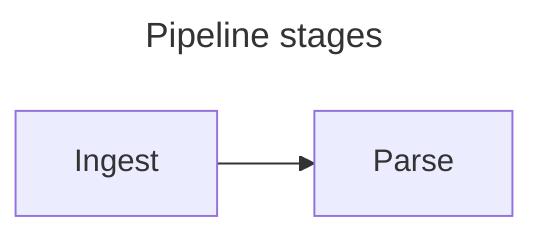

# Hermes — Mermaid Diagrams: Design

**Date:** 2026-08-11
**Status:** Approved design, pending implementation plan
**Release:** v0.7.0

## Overview

A paper often needs a flowchart, a sequence diagram or a state machine, and
Hermes has no way to draw one. This renders a ` ```mermaid ` fence as a
diagram in the preview and in exported PDFs, with the captions, numbering,
alignment and scroll-sync anchoring a chart already gets.

## Decisions

| Question | Decision |
|---|---|
| Dependency | `mermaid`, dynamically imported |
| Dark mode | No theming — a white card, as charts get |
| Captions | Mermaid's own frontmatter `title:`, stripped before rendering |
| Scroll sync | `data-source-line` written by hand, as the chart branch does |
| Scope | Rendering only; no Insert menu route, no diagram builder |

Every one of these follows a precedent already in the codebase. That is the
main finding of this design: the roadmap expected Mermaid to need new
mechanisms in three places, and on inspection it needs none.

### The roadmap's premise was wrong

The v0.7 entry says:

> `lib/figures.ts` currently decides figure-hood from a Vega-Lite `title` or an
> image's alt text, so a captioned diagram needs that extended — Mermaid has no
> `title` field of its own, so the caption has to come from somewhere new,
> which is the one place this feature cannot simply follow the chart precedent.

Mermaid **does** have a title. `extractFrontMatter` in mermaid 11.16.1 reads
`parsed.title` into the diagram's metadata, and `Diagram.fromText(text, {
title: processed.title })` passes it to the renderer — `getDiagramTitle` is
called in 83 places across the diagram types. So this is valid:

````markdown

````

That is the same shape as a Vega-Lite `title`, including the part that decides
the design: it is drawn *into* the SVG, so it must be removed before rendering
or it appears twice — once in the diagram, once in the figcaption. Removing it
is the job `rewriteChartSpec` already does for charts.

Update the roadmap entry when this lands; leaving the claim standing would send
the next reader looking for a problem that does not exist.

### Dark mode needs no theming

The roadmap expected Mermaid's theming to be "driven from the palette and
re-rendered on a theme change", because its output is an SVG with baked-in
colours that `style.css` cannot reach.

All of that is true, and Vega has exactly the same problem. Hermes' existing
answer is in the dark palette block of `style.css`:

```css
/* Vega draws in dark ink on a transparent ground, so a figure needs a light
   ground under it. */
--figure-bg: #ffffff;  --figure-pad: 12px;  --figure-radius: 6px;
```

Charts are not re-themed in dark mode; they are placed on a white card.
`.mermaid-diagram` joins that rule and inherits the whole answer: no theme
hook into `Preview`, no colour mapping to maintain, no re-render on toggle, and
a diagram that looks like the chart beside it. It also matches the PDF, which
is always light.

## Architecture

```
```mermaid fence
   │
   ├─ figures.ts   numberFigures()  reads the frontmatter title as the caption
   │                                and stamps {number, caption} on the token
   │
   ├─ renderer.ts  fence renderer   emits a placeholder carrying the diagram
   │                                source with its title removed, plus the
   │                                data-source-line anchor; wraps it in
   │                                <figure>/<figcaption> when captioned
   │
   ├─ mermaid.ts   hydrator         swaps each placeholder for real SVG
   │                                (dynamic import, cached per source)
   │
   └─ style.css    .mermaid-diagram joins the existing figure-card rule
```

### Why the dependency can be large

`mermaid.core.mjs` is ~51 KB and each diagram type is a separate lazily-loaded
chunk, so a paper with one flowchart pays for one diagram type. It is imported
with `await import('mermaid')` at the point of use, never statically — the same
constraint `charts.ts` documents for `vega-embed`, and the same on-demand
pattern `codeHighlight.ts` uses for language grammars.

### One deliberate divergence from the chart hydrator

`createChartHydrator` tracks Vega `view` objects and calls `finalize()` on
them, because a live view holds listeners and timers. A Mermaid render returns
a static SVG string; there is nothing to leak. So `createMermaidHydrator`
follows the simpler `createCodeHydrator`: a cache keyed on source text, a
generation guard against overlapping passes, and eviction of entries whose
source left the document. No view registry, and no `destroy()`.

### Ids

`mermaid.render(id, text)` requires a caller-supplied id and injects a
`<style>` block scoped to it, so the hydrator issues ids from a monotonic
counter. Caching by source text keeps a reused node's id stable.

## Components

| File | Change |
|---|---|
| `frontend/src/lib/mermaidSource.ts` | **New.** The fence's optional YAML frontmatter |
| `frontend/src/lib/mermaid.ts` | **New.** The hydrator, the render function, the error card |
| `frontend/src/lib/figures.ts` | `mermaidCaption`, and a `mermaid` branch in `numberFigures` |
| `frontend/src/lib/renderer.ts` | The fence rule becomes a dispatch; a `mermaid` branch |
| `frontend/src/Preview.svelte` | A third hydrator, invalidating anchors on completion |
| `frontend/public/style.css` | `.mermaid-diagram` and `.mermaid-error` join existing rules |
| `frontend/package.json` | `mermaid` as a dependency |

### `mermaidSource.ts`

```ts
export interface MermaidSource {
  /** The frontmatter `title:`, or '' when there is none. */
  title: string
  /** The diagram source with the title line removed, ready to render. */
  body: string
}
export function parseMermaidSource(text: string): MermaidSource
```

Its own module because it has two unrelated consumers — `figures.ts` wants the
title, `renderer.ts` wants the body — and living in either would make the other
import across a boundary that does not fit.

Two behaviours are deliberate:

**It removes only the `title:` line, not the whole frontmatter block.** A block
can also carry `config:`, and taking that with it would silently change how the
diagram renders. This is the same care `rewriteChartSpec` takes in deleting
only `text` and keeping the rest of a title object. If nothing survives, the
`---` delimiters go too.

**It recognises only a single-line scalar `title:`.** Mermaid parses full YAML;
this does not. The asymmetry is safe in the direction it fails: an
unrecognised title stays in the source, Mermaid draws it inside the SVG, and
the diagram is simply not a numbered figure. A caption is never wrong, only
absent.

### `mermaid.ts`

```ts
export type RenderFn = (id: string, source: string) => Promise<string>  // → SVG markup
export interface MermaidHydrator { hydrate(container: HTMLElement): Promise<void> }
export function createMermaidHydrator(render?: RenderFn): MermaidHydrator
export async function renderMermaid(id: string, source: string): Promise<string>
```

`render` is injectable for the reason `createChartHydrator` takes `embed` and
`Preview` takes `collectAnchorsFn`: Mermaid appends temporary nodes to
`document.body` mid-render and needs real layout, which jsdom cannot provide.

`renderMermaid` performs the dynamic import, initialises once with
`startOnLoad: false` and `suppressErrorRendering: true`, and returns the SVG.

`suppressErrorRendering` is load-bearing, not a preference. Without it a parse
failure makes Mermaid render **its own error diagram** into the page instead of
throwing; with it, Mermaid removes its temporary elements and rethrows, which
is what lets the hydrator show the same error card a chart gets.

### `figures.ts`

```ts
/** The caption a `mermaid` block's source carries, or '' for none. */
export function mermaidCaption(source: string): string
```

A sibling of `chartCaption`, reading `parseMermaidSource(source).title`. The
`mermaid` branch in `numberFigures` sits beside the `vega-lite` one and shares
its counter, so charts, images and diagrams number in a single document-order
sequence.

### The emitted markup

Uncaptioned — the anchor is on the placeholder itself:

```html
<div class="mermaid-diagram" data-source-line="12" data-source="flowchart LR&#10;  A --&gt; B"></div>
```

Captioned — the anchor moves **onto** the `<figure>` and off the child, because
`collectAnchors` treats every `[data-source-line]` as an anchor and two at
different offsets for one source line is a degenerate segment for
`previewOffsetForLine` to interpolate across:

```html
<figure data-source-line="12">
  <div class="mermaid-diagram" data-source="flowchart LR&#10;  A --&gt; B"></div>
  <figcaption>Figure 1 — Pipeline stages</figcaption>
</figure>
```

`data-source` carries the body from `parseMermaidSource`, HTML-escaped through
`md.utils.escapeHtml`, exactly as the chart branch escapes `data-spec`.

### `style.css`

`.mermaid-diagram` joins line **321** (the figure card), **341** (`svg`
sizing), **365 / 370 / 375** (the three `data-figure-align` blocks, so an
uncaptioned diagram still aligns) and **611** (print `break-inside: avoid`).
`.mermaid-error` joins **528**.

The error card reuses `--chart-error-fg` / `--chart-error-bg`, which are
already declared in the light, dark and print blocks and so satisfy
`styleContract.test.ts`. A diagram is not a chart, so the names read slightly
wrong; renaming them would touch three palette blocks plus `charts.ts` for a
cosmetic gain, and was declined.

## Error handling

| Situation | Result |
|---|---|
| Invalid diagram syntax | `.mermaid-error` card: `Diagram error: <message>` |
| Mermaid module fails to load | The same card. The dynamic import sits *inside* the try, so "cannot load the renderer" and "cannot render" report identically — the choice `embedChart` documents at `charts.ts:132` |
| Empty fence | An error card, since Mermaid rejects empty input. Consistent with an empty `vega-lite` fence, which reports `Invalid JSON` today. It does mean a card is visible while a diagram is being typed; charts already behave this way |
| Diagram in a blockquote or list item | Renders, never numbered — `numberFigures` considers only level-0 tokens, matching charts |
| Title present, rest of the YAML malformed | The title is read; Mermaid throws on the rest, so the error card shows. A caption is never displayed against a diagram that did not render |

### A recorded hazard

Caching keyed on source text means two *identical* diagrams share one rendered
SVG, including its generated id, which Mermaid's injected `<style>` targets
with `#id` selectors. Duplicate ids are invalid HTML but harmless here: both
copies carry identical styles and both render correctly. The alternative is a
full Mermaid render per duplicate, which costs more than the problem is worth.

## Testing

| File | What it pins |
|---|---|
| `mermaidSource.test.ts` (new) | Title read quoted and unquoted; no frontmatter; `config:` survives the title's removal; delimiters removed when the title was the only key; an unrecognised title stays in the body with `title: ''` |
| `mermaid.test.ts` (new) | With an injected fake `render`: placeholders become SVG; identical sources render once; a newer pass abandons an older one; entries evict when their source leaves; a throwing render produces the error card |
| `figures.test.ts` | A captioned diagram becomes `Figure N`; an uncaptioned one does not; numbering interleaves correctly with charts and images |
| `renderer.test.ts` | Emits `.mermaid-diagram` carrying `data-source` and `data-source-line`; the captioned form puts the anchor on the `<figure>` and not on the child — the double-anchor bug documented at `renderer.ts:68` |

### What is not tested

Real Mermaid rendering. jsdom has no layout and Mermaid writes to
`document.body` mid-render — the same reason `charts.ts` never embeds real Vega
in a test. That is what makes the injectable `render` load-bearing rather than
decorative.

The white card's appearance is also untested; `styleContract.test.ts` only
guarantees that no literal colour crept into a rule.

## Manual check

1. A titled flowchart renders as a numbered figure with its caption below, and
   the title is **not** also drawn inside the diagram.
2. In dark mode the diagram sits on a white card and is legible.
3. Export PDF includes the diagram, not split across a page break.
4. Invalid syntax shows an error card and the rest of the preview still renders.
5. A chart, an image and a diagram in one document number 1, 2, 3 in document
   order.
6. Scroll sync stays aligned past a tall diagram.

## Out of scope

An `Insert → Diagram` menu route of starter templates, and any graphical
diagram builder. Authors write the fence themselves, or reach for
`Insert → Code Block`.
