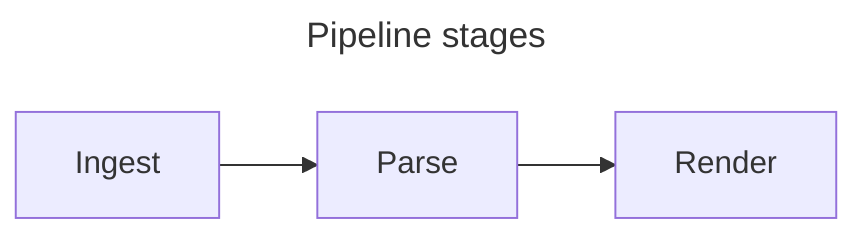
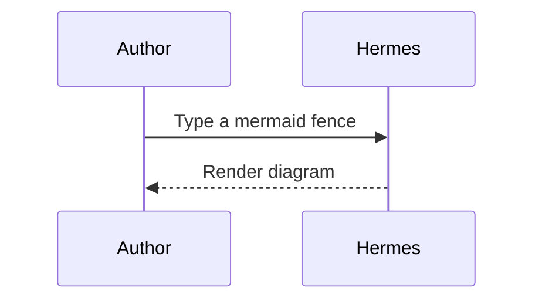

# Hermes Test Document

A tour of everything Hermes renders, written to be read as a PDF. Every
section shows the markdown first, in a code block, and then the same text as
Hermes renders it — so the page itself is the proof. Open this file in Hermes
and press ⌘E to export it.

Swap `csl:` in the frontmatter to `ieee`, `vancouver`, `chicago-author-date`
or `harvard` to re-render every citation and the References list in that
style.

**About the bibliography.** `zotero-export-text.bib` is auto-synced from
Zotero — do not hand-edit it, and do not add fixture entries to it. The
citations section names specific works, so if the library changes, those
expectations need updating rather than the file.

## 1. Text basics

### Markdown

````markdown
This paragraph has **bold text**, *italic text*, ***bold italic***, `inline
code`, ~~strikethrough~~, and a [link to the Wails docs](https://v3.wails.io).

A second paragraph, to show spacing.

> A blockquote: "The purpose of computing is insight, not numbers."

---

That was a horizontal rule.
````

### Rendered

This paragraph has **bold text**, *italic text*, ***bold italic***, `inline
code`, ~~strikethrough~~, and a [link to the Wails docs](https://v3.wails.io).

A second paragraph, to show spacing.

> A blockquote: "The purpose of computing is insight, not numbers."

---

That was a horizontal rule.

## 2. Lists

### Markdown

````markdown
1. First ordered item
2. Second ordered item
   1. Nested ordered child
   2. Another nested child
3. Third ordered item

- Unordered item with a sub-list:
  - Nested bullet one
  - Nested bullet two
- Unordered item with `code` and **bold** inside
````

### Rendered

1. First ordered item
2. Second ordered item
   1. Nested ordered child
   2. Another nested child
3. Third ordered item

- Unordered item with a sub-list:
  - Nested bullet one
  - Nested bullet two
- Unordered item with `code` and **bold** inside

## 3. Table

The `:---:` marker centres a column, and maths works inside a cell.

### Markdown

````markdown
| Quantity | Symbol | Unit |
|----------|:------:|------|
| Energy | $E$ | joule |
| Entropy | $S$ | J/K |
| Density matrix | $\rho_\mathcal{S}$ | — |
````

### Rendered

| Quantity | Symbol | Unit |
|----------|:------:|------|
| Energy | $E$ | joule |
| Entropy | $S$ | J/K |
| Density matrix | $\rho_\mathcal{S}$ | — |

## 4. Code blocks

A fence naming a language is syntax-coloured; a fence naming a language
Hermes does not know renders as plain text rather than erroring.

### Markdown

````markdown
```python
def entropy(p):
    """Shannon entropy."""
    return -sum(x * math.log2(x) for x in p if x > 0)
```

```notalang
this fence names a language nobody has heard of
```
````

### Rendered

```python
def entropy(p):
    """Shannon entropy."""
    return -sum(x * math.log2(x) for x in p if x > 0)
```

```notalang
this fence names a language nobody has heard of
```

## 5. Inline maths

Single dollars delimit inline maths. Plain dollar amounts are left alone.

### Markdown

````markdown
Euler's identity $e^{i\pi} + 1 = 0$ sits inside a sentence. The mass–energy
relation $E = mc^2$, a subscripted state $\rho_\mathcal{S}$, a fraction
$\tfrac{a+b}{c}$, and Greek letters $\alpha, \beta, \gamma$ all sit on the
surrounding baseline. Plain dollar amounts like $5 and $10 do not become maths.
````

### Rendered

Euler's identity $e^{i\pi} + 1 = 0$ sits inside a sentence. The mass–energy
relation $E = mc^2$, a subscripted state $\rho_\mathcal{S}$, a fraction
$\tfrac{a+b}{c}$, and Greek letters $\alpha, \beta, \gamma$ all sit on the
surrounding baseline. Plain dollar amounts like $5 and $10 do not become maths.

## 6. Display maths

Double dollars set an equation on its own line, centred.

### Markdown

````markdown
The Gaussian integral:

$$\int_{-\infty}^{\infty} e^{-x^2}\,dx = \sqrt{\pi}$$

A matrix and a summation:

$$A = \begin{pmatrix} 1 & 2 \\ 3 & 4 \end{pmatrix}, \qquad \sum_{n=1}^{\infty} \frac{1}{n^2} = \frac{\pi^2}{6}$$

Aligned equations:

$$\begin{aligned} \nabla \cdot \mathbf{E} &= \frac{\rho}{\varepsilon_0} \\ \nabla \cdot \mathbf{B} &= 0 \end{aligned}$$
````

### Rendered

The Gaussian integral:

$$\int_{-\infty}^{\infty} e^{-x^2}\,dx = \sqrt{\pi}$$

A matrix and a summation:

$$A = \begin{pmatrix} 1 & 2 \\ 3 & 4 \end{pmatrix}, \qquad \sum_{n=1}^{\infty} \frac{1}{n^2} = \frac{\pi^2}{6}$$

Aligned equations:

$$\begin{aligned} \nabla \cdot \mathbf{E} &= \frac{\rho}{\varepsilon_0} \\ \nabla \cdot \mathbf{B} &= 0 \end{aligned}$$

## 7. Charts

A `vega-lite` fence containing a Vega-Lite spec becomes a live chart. The
data can be inlined, as here, or built with Insert → Chart… from a pasted or
imported table.

### Markdown

````markdown
```vega-lite
{
  "description": "Simple bar chart",
  "data": {
    "values": [
      {"category": "A", "value": 28}, {"category": "B", "value": 55},
      {"category": "C", "value": 43}, {"category": "D", "value": 91},
      {"category": "E", "value": 81}, {"category": "F", "value": 53}
    ]
  },
  "mark": "bar",
  "encoding": {
    "x": {"field": "category", "type": "nominal", "axis": {"labelAngle": 0}},
    "y": {"field": "value", "type": "quantitative"}
  }
}
```

```vega-lite
{
  "description": "Line chart with points",
  "data": {
    "values": [
      {"x": 0, "y": 1.0}, {"x": 1, "y": 1.6}, {"x": 2, "y": 2.6},
      {"x": 3, "y": 4.1}, {"x": 4, "y": 6.6}, {"x": 5, "y": 10.5}
    ]
  },
  "mark": {"type": "line", "point": true},
  "encoding": {
    "x": {"field": "x", "type": "quantitative"},
    "y": {"field": "y", "type": "quantitative"}
  }
}
```
````

### Rendered

```vega-lite
{
  "description": "Simple bar chart",
  "data": {
    "values": [
      {"category": "A", "value": 28}, {"category": "B", "value": 55},
      {"category": "C", "value": 43}, {"category": "D", "value": 91},
      {"category": "E", "value": 81}, {"category": "F", "value": 53}
    ]
  },
  "mark": "bar",
  "encoding": {
    "x": {"field": "category", "type": "nominal", "axis": {"labelAngle": 0}},
    "y": {"field": "value", "type": "quantitative"}
  }
}
```

```vega-lite
{
  "description": "Line chart with points",
  "data": {
    "values": [
      {"x": 0, "y": 1.0}, {"x": 1, "y": 1.6}, {"x": 2, "y": 2.6},
      {"x": 3, "y": 4.1}, {"x": 4, "y": 6.6}, {"x": 5, "y": 10.5}
    ]
  },
  "mark": {"type": "line", "point": true},
  "encoding": {
    "x": {"field": "x", "type": "quantitative"},
    "y": {"field": "y", "type": "quantitative"}
  }
}
```

### More chart types

The four shapes the chart builder can also produce: a histogram, which bins
one column and counts the rows in each bin; a heatmap, which colours a grid by
a quantity; error bars, which summarise repeated measurements; and a pie,
whose slice size is `theta` and whose category is the colour. Each carries a
`title`, which — as section 8 explains — makes it a numbered figure.

#### Markdown

````markdown
```vega-lite
{
  "title": "Distribution of recovered masses",
  "data": {"values": [
    {"mass": 1.2}, {"mass": 1.9}, {"mass": 2.4}, {"mass": 2.6}, {"mass": 3.1}
  ]},
  "mark": "bar",
  "encoding": {
    "x": {"field": "mass", "bin": true, "type": "quantitative"},
    "y": {"aggregate": "count", "type": "quantitative"}
  }
}
```

```vega-lite
{
  "title": "Detections by day and hour",
  "data": {"values": [
    {"day": "Mon", "hour": 9, "rate": 4}, {"day": "Mon", "hour": 10, "rate": 7},
    {"day": "Tue", "hour": 9, "rate": 2}, {"day": "Tue", "hour": 10, "rate": 9}
  ]},
  "mark": "rect",
  "encoding": {
    "x": {"field": "day", "type": "nominal"},
    "y": {"field": "hour", "type": "nominal"},
    "color": {"field": "rate", "type": "quantitative", "aggregate": "mean"}
  }
}
```

```vega-lite
{
  "title": "Yield by variety, with 95% confidence intervals",
  "data": {"values": [
    {"variety": "A", "yield": 21}, {"variety": "A", "yield": 25},
    {"variety": "A", "yield": 23}, {"variety": "B", "yield": 31},
    {"variety": "B", "yield": 28}, {"variety": "B", "yield": 34}
  ]},
  "mark": {"type": "errorbar", "extent": "ci"},
  "encoding": {
    "x": {"field": "variety", "type": "nominal"},
    "y": {"field": "yield", "type": "quantitative"}
  }
}
```

```vega-lite
{
  "title": "Share of detections by instrument",
  "data": {"values": [
    {"instrument": "A", "count": 12}, {"instrument": "B", "count": 7},
    {"instrument": "C", "count": 4}
  ]},
  "mark": "arc",
  "encoding": {
    "theta": {"field": "count", "type": "quantitative"},
    "color": {"field": "instrument", "type": "nominal"}
  }
}
```
````

#### Rendered

```vega-lite
{
  "title": "Distribution of recovered masses",
  "data": {"values": [
    {"mass": 1.2}, {"mass": 1.9}, {"mass": 2.4}, {"mass": 2.6}, {"mass": 3.1}
  ]},
  "mark": "bar",
  "encoding": {
    "x": {"field": "mass", "bin": true, "type": "quantitative"},
    "y": {"aggregate": "count", "type": "quantitative"}
  }
}
```

```vega-lite
{
  "title": "Detections by day and hour",
  "data": {"values": [
    {"day": "Mon", "hour": 9, "rate": 4}, {"day": "Mon", "hour": 10, "rate": 7},
    {"day": "Tue", "hour": 9, "rate": 2}, {"day": "Tue", "hour": 10, "rate": 9}
  ]},
  "mark": "rect",
  "encoding": {
    "x": {"field": "day", "type": "nominal"},
    "y": {"field": "hour", "type": "nominal"},
    "color": {"field": "rate", "type": "quantitative", "aggregate": "mean"}
  }
}
```

```vega-lite
{
  "title": "Yield by variety, with 95% confidence intervals",
  "data": {"values": [
    {"variety": "A", "yield": 21}, {"variety": "A", "yield": 25},
    {"variety": "A", "yield": 23}, {"variety": "B", "yield": 31},
    {"variety": "B", "yield": 28}, {"variety": "B", "yield": 34}
  ]},
  "mark": {"type": "errorbar", "extent": "ci"},
  "encoding": {
    "x": {"field": "variety", "type": "nominal"},
    "y": {"field": "yield", "type": "quantitative"}
  }
}
```

```vega-lite
{
  "title": "Share of detections by instrument",
  "data": {"values": [
    {"instrument": "A", "count": 12}, {"instrument": "B", "count": 7},
    {"instrument": "C", "count": 4}
  ]},
  "mark": "arc",
  "encoding": {
    "theta": {"field": "count", "type": "quantitative"},
    "color": {"field": "instrument", "type": "nominal"}
  }
}
```

## 8. Figures

A caption is what makes a figure. A chart's `title`, an image's alt text or a
Mermaid diagram's `title` becomes the caption, drawn once below the figure,
and every captioned figure is numbered in document order — so the four titled
charts above are Figures 1–4 and the sequence continues here. An image with
empty alt text, or an untitled diagram, stays decorative: no number, no
caption. Images may be remote URLs or paths relative to the document.

### Markdown

````markdown
```vega-lite
{
  "title": "Recovered sources",
  "data": {"values": [
    {"category": "A", "value": 12}, {"category": "B", "value": 27},
    {"category": "C", "value": 19}
  ]},
  "mark": "bar",
  "encoding": {
    "x": {"field": "category", "type": "nominal"},
    "y": {"field": "value", "type": "quantitative"}
  }
}
```

A captioned remote image:


A decorative image, with empty alt text:


A local image, resolved relative to this document's own folder:


A chart that sets its own `"width"`, overriding View → Chart Width:

```vega-lite
{
  "width": 150,
  "data": {"values": [{"x": 0, "y": 1}, {"x": 1, "y": 2}, {"x": 2, "y": 4}]},
  "mark": "point",
  "encoding": {
    "x": {"field": "x", "type": "quantitative"},
    "y": {"field": "y", "type": "quantitative"}
  }
}
```

A titled Mermaid diagram:



An untitled diagram of a different kind:


````

### Rendered

```vega-lite
{
  "title": "Recovered sources",
  "data": {"values": [
    {"category": "A", "value": 12}, {"category": "B", "value": 27},
    {"category": "C", "value": 19}
  ]},
  "mark": "bar",
  "encoding": {
    "x": {"field": "category", "type": "nominal"},
    "y": {"field": "value", "type": "quantitative"}
  }
}
```

A captioned remote image:


A decorative image, with empty alt text:


A local image, resolved relative to this document's own folder:


A chart that sets its own `"width"`, overriding View → Chart Width:

```vega-lite
{
  "width": 150,
  "data": {"values": [{"x": 0, "y": 1}, {"x": 1, "y": 2}, {"x": 2, "y": 4}]},
  "mark": "point",
  "encoding": {
    "x": {"field": "x", "type": "quantitative"},
    "y": {"field": "y", "type": "quantitative"}
  }
}
```

A titled Mermaid diagram:


An untitled diagram of a different kind:


View → Figure Alignment moves every figure and decorative image together,
captions included; this PDF shows whichever alignment was set when it was
exported.

## 9. Citations

Pandoc-style keys — `[@key]`, `@key` for a narrative citation, `-@key` to
suppress the author, and a locator after a comma — are resolved against the
`.bib` named in the frontmatter and formatted in the chosen CSL style. Every
work cited collects into the References list at the end of the document.

### Markdown

````markdown
A simple citation [@zurekQuantumTheoryClassical2018], a multi-cite
[@everettRelativeStateFormulation1957; @zurekQuantumTheoryClassical2018], and a
narrative one: @korbiczRoadsObjectivityQuantum2021 sets out the argument.

Suppressed author, because the year is already in the sentence — Everett's 1957
paper [-@everettRelativeStateFormulation1957] — and a locator attached to a key
[see @kloeffelProspectsSpinBasedQuantum2013, pp. 51-53]. A section locator
works the same way [@hanceWhatDoesIt2022, sec. 2].

A group split by a hard line wrap formats like any other: [see
@leStrongQuantumDarwinism2019, pp. 3-4].

Several works supporting one claim [@horodeckiQuantumOriginsObjectivity2015;
@undenRevealingEmergenceClassicality2019; @korbiczRoadsObjectivityQuantum2021],
and a citation carried into a quotation intact:

> Objectivity is emergent [@leStrongQuantumDarwinism2019].

Eight authors collapse to *et al.* [@feinQuantumSuperpositionMolecules2019]. A
work with no year reads *n.d.* [@fineBohrsResponseEPR]. A work with no author
falls back to its title [@DecoherenceQuantumToClassicalTransition2007]. A
preprint renders as one [@mullerSixMeasurementProblems2023].

An unknown key renders as a visible inline error without blanking the rest of
the page: [@notakey1999]. A group mixing a good key with a bad one is reported
the same way [@zurekQuantumTheoryClassical2018; @alsomissing1999].
````

### Rendered

A simple citation [@zurekQuantumTheoryClassical2018], a multi-cite
[@everettRelativeStateFormulation1957; @zurekQuantumTheoryClassical2018], and a
narrative one: @korbiczRoadsObjectivityQuantum2021 sets out the argument.

Suppressed author, because the year is already in the sentence — Everett's 1957
paper [-@everettRelativeStateFormulation1957] — and a locator attached to a key
[see @kloeffelProspectsSpinBasedQuantum2013, pp. 51-53]. A section locator
works the same way [@hanceWhatDoesIt2022, sec. 2].

A group split by a hard line wrap formats like any other: [see
@leStrongQuantumDarwinism2019, pp. 3-4].

Several works supporting one claim [@horodeckiQuantumOriginsObjectivity2015;
@undenRevealingEmergenceClassicality2019; @korbiczRoadsObjectivityQuantum2021],
and a citation carried into a quotation intact:

> Objectivity is emergent [@leStrongQuantumDarwinism2019].

Eight authors collapse to *et al.* [@feinQuantumSuperpositionMolecules2019]. A
work with no year reads *n.d.* [@fineBohrsResponseEPR]. A work with no author
falls back to its title [@DecoherenceQuantumToClassicalTransition2007]. A
preprint renders as one [@mullerSixMeasurementProblems2023].

An unknown key renders as a visible inline error without blanking the rest of
the page: [@notakey1999]. A group mixing a good key with a bad one is reported
the same way [@zurekQuantumTheoryClassical2018; @alsomissing1999].

Titles in this export carry BibTeX capital-protection like `{{Quantum
Darwinism}}`, and surnames like `{Olaya-Castro}` are braced to keep them
whole; the References list shows *Quantum Darwinism* and *Olaya-Castro*, never
the braces. Author-year disambiguation (`2021a` / `2021b`) cannot be shown
here, because no two works in this library share a first author and a year.

## 10. Things that do not become citations

None of the following turns into a citation or reaches the References list.

### Markdown

````markdown
- An email address: write to a.zurek@example.org for the dataset.
- Plain brackets used as brackets: [see the appendix] and [2].
- A markdown link: [the project page](https://example.org/project).
- A citation inside a code span: `[@zurekQuantumTheoryClassical2018]`.
- A fenced code block:

```text
[@everettRelativeStateFormulation1957] is not formatted here either.
```
````

### Rendered

- An email address: write to a.zurek@example.org for the dataset.
- Plain brackets used as brackets: [see the appendix] and [2].
- A markdown link: [the project page](https://example.org/project).
- A citation inside a code span: `[@zurekQuantumTheoryClassical2018]`.
- A fenced code block:

```text
[@everettRelativeStateFormulation1957] is not formatted here either.
```

## 11. Errors are contained

Mistakes render in place, and everything after them still renders. These
three are **supposed** to look broken.

### Markdown

````markdown
Invalid LaTeX renders inline in red: $\thisisnotacommand{x}$

Broken Vega-Lite JSON renders an error card:

```vega-lite
{ "mark": "bar", this is not valid JSON
```

Broken Mermaid syntax renders the same kind of card:

```mermaid
this is not a valid diagram type
```
````

### Rendered

Invalid LaTeX renders inline in red: $\thisisnotacommand{x}$

Broken Vega-Lite JSON renders an error card:

```vega-lite
{ "mark": "bar", this is not valid JSON
```

Broken Mermaid syntax renders the same kind of card:

```mermaid
this is not a valid diagram type
```

If you can read this line with normal styling, error containment works. ✅

## 12. Beyond the page

Some of Hermes lives in the editor rather than on the page, and a PDF cannot
show it. Briefly, for completeness:

- **Chart builder.** Insert → Chart… builds a `vega-lite` block from a pasted
  or imported table, and reopens an existing block with every control — data
  included — prefilled. A chart using a property the builder cannot express,
  like the `axis` in section 7's bar chart, is refused with an explanation.
- **Formatting commands.** ⌘B, ⌘I and ⌘⇧K toggle bold, italic and code;
  ⌘1–⌘6 set headings; ⌘⇧8 and ⌘⇧7 make bullet and numbered lists. They never
  rewrite frontmatter, fenced code or inline code spans.
- **Folding.** ⌘⌥[ and ⌘⌥] fold and unfold the block at the cursor; View →
  Fold All Code Blocks collapses every fence to its opening line.
- **Live bibliography.** Saving the `.bib` from Zotero while the document is
  open refreshes the preview on its own.
- **Appearance.** View → Appearance follows System, Light or Dark; the
  exported PDF is always light, whatever the screen theme, with figures kept
  whole across page breaks.
